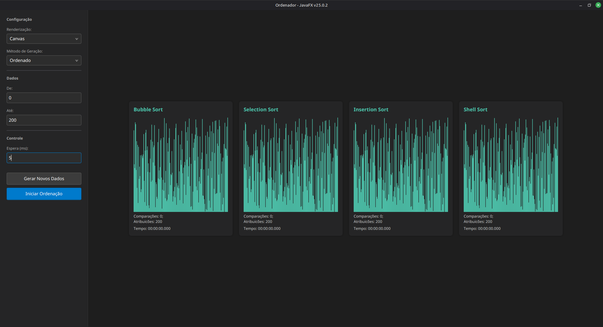

# 📊 Sorting Algorithms Visualizer


> Uma ferramenta interativa de alta performance para visualização e análise comparativa de algoritmos de ordenação, desenvolvida com JavaFX e Multithreading.

---

## 🖼️ Preview

<div align="center">
  
  <br>
  <em>Interface principal exibindo a execução simultânea de múltiplos algoritmos.</em>
</div>

---

## 🚀 Sobre o Projeto

Este projeto é uma aplicação desktop robusta projetada para fins educacionais e de análise de performance. O objetivo principal é demonstrar visualmente como diferentes algoritmos de ordenação manipulam dados em memória, permitindo uma comparação direta de eficiência (tempo e operações) em tempo real.

A aplicação se destaca pelo uso de **concorrência** para garantir que a interface do usuário permaneça responsiva enquanto múltiplos algoritmos processam grandes conjuntos de dados simultaneamente.

## ✨ Funcionalidades Principais

*   **Visualização Simultânea:** Execute e compare Bubble Sort, Selection Sort, Insertion Sort e Shell Sort lado a lado.
*   **Controle de Renderização Híbrido:**
    *   **Modo Canvas:** Renderização de alta performance desenhando pixels diretamente (ideal para grandes volumes de dados).
    *   **Modo VBox (Node Graph):** Renderização baseada em componentes de UI nativos do JavaFX.
*   **Gerenciamento de Execução:** Controles granulares para Iniciar, Pausar, Retomar e Parar a execução das threads de ordenação.
*   **Configuração Dinâmica:**
    *   Ajuste de *Throttle* (atraso em ms) para controle de velocidade da animação.
    *   Geração de dados Aleatórios ou Pré-Ordenados (para testes de pior/melhor caso).
    *   Definição customizada de range e quantidade de elementos.
*   **Métricas em Tempo Real:** Monitoramento de comparações, atribuições (swaps) e tempo decorrido (nanossegundos).

## 🧠 Algoritmos e Complexidade

Abaixo, uma comparação teórica dos algoritmos implementados neste projeto:

| Algoritmo | Melhor Caso (Time) | Caso Médio (Time) | Pior Caso (Time) | Complexidade (Space) | Estável? |
| :--- | :---: | :---: | :---: | :---: | :---: |
| **Bubble Sort** | $O(n)$ | $O(n^2)$ | $O(n^2)$ | $O(1)$ | Sim |
| **Insertion Sort** | $O(n)$ | $O(n^2)$ | $O(n^2)$ | $O(1)$ | Sim |
| **Selection Sort** | $O(n^2)$ | $O(n^2)$ | $O(n^2)$ | $O(1)$ | Não |
| **Shell Sort** | $O(n \log n)$ | Depende do Gap | $O(n^2)$ | $O(1)$ | Não |

---

## 🛠️ Arquitetura e Detalhes Técnicos

O projeto segue princípios de **Clean Code** e separação de responsabilidades.

### Estrutura de Pacotes
```bash
src/main/java/org/viniciuscsantos
├── Enums          # Definições de tipos (Algorithms.java)
├── Helpers        # Utilitários (TimeManager, ArrayHelper) e Lógica Core (SortAlgorithms)
├── Interfaces     # Contratos de abstração (IChartView)
├── Views          # Camada de Apresentação (JavaFX, Canvas, Charts)
└── Main.java      # Entry Point
```

### Destaques de Implementação

1.  **Multithreading & Concorrência:**
    *   Cada algoritmo roda em sua própria `Thread`, prevenindo o congelamento da UI (Main Thread).
    *   Uso de `ConcurrentHashMap` para gerenciar estados de execução (running/paused) de forma segura.
    *   Uso de `AtomicReference` para passar dados (snapshots do array) da thread de processamento para a thread de renderização (JavaFX Application Thread).

2.  **Design Patterns:**
    *   **Strategy Pattern:** Implícito na seleção de algoritmos e métodos de renderização.
    *   **Observer Pattern:** Atualização reativa da UI através do `AnimationTimer`.

3.  **Performance:**
    *   O `CanvasChartView` utiliza o `GraphicsContext` para redesenhar apenas o necessário, permitindo visualizações fluidas mesmo com milhares de elementos, superando as limitações do grafo de cena tradicional do JavaFX.

---

## 📦 Instalação e Execução

### Pré-requisitos
*   **Java JDK 25+**
*   **Maven 3.6+**

### Passos

1.  **Clone o repositório:**
    ```bash
    git clone https://github.com/seu-usuario/sort-algorithms.git
    cd sort-algorithms
    ```

2.  **Compile o projeto:**
    ```bash
    mvn clean install
    ```

3.  **Execute a aplicação:**
    ```bash
    mvn javafx:run
    ```

---

## 🔮 Roadmap (Melhorias Futuras)

*   [ ] Adicionar Quick Sort, Merge Sort e Heap Sort.
*   [ ] Implementar visualização sonora (som baseado no valor do elemento).
*   [ ] Adicionar modo "Dark Theme".
*   [ ] Exportar estatísticas para CSV.

## 🤝 Contribuição

Contribuições são bem-vindas! Sinta-se à vontade para abrir **Issues** ou enviar **Pull Requests**.

1.  Faça um Fork do projeto.
2.  Crie uma Branch para sua Feature (`git checkout -b feature/NovaFeature`).
3.  Faça o Commit (`git commit -m 'Adicionando nova feature'`).
4.  Faça o Push (`git push origin feature/NovaFeature`).
5.  Abra um Pull Request.

## 📝 Licença

Distribuído sob a licença MIT. Veja `LICENSE` para mais informações.

# 📦 Build e Empacotamento (Instaladores Nativos)

Este projeto utiliza o sistema de módulos do Java (Jigsaw) combinado com o Maven para gerar uma imagem runtime otimizada (`jlink`) e instaladores nativos (`jpackage`) para Linux e Windows.

---

## 📋 Pré-requisitos

Antes de gerar os instaladores, certifique-se de ter as ferramentas de sistema instaladas:

- **Windows (.msi):**  
  Instale o [WiX Toolset](https://github.com/wixtoolset/wix3/releases) (necessário para o `jpackage` gerar instaladores Windows).

## 1️⃣ Compilar e Gerar o Runtime (jlink)

O primeiro passo é limpar o projeto, compilar e gerar a imagem JRE customizada contendo o JavaFX e o módulo do aplicativo.

Execute na raiz do projeto:

```bash
mvn clean package javafx:jlink
```

### 🧪 Nota de Teste

Após a execução, você pode testar se a imagem foi gerada corretamente rodando:

- **Linux:**
  ```bash
  ./target/image/bin/java -m sort.algorithms/org.viniciuscsantos.Main
  ```

- **Windows (PowerShell):**
  ```powershell 
  . arget\imagein\java.exe -m sort.algorithms/org.viniciuscsantos.Main
  ```

## 2️⃣ Gerar o Instalador (jpackage)

Após gerar o runtime com sucesso (`target/image`), utilize os comandos abaixo de acordo com o seu sistema operacional.

Os instaladores serão gerados na pasta `dist/`.

---

### 🐧 Para Linux (.deb)

Requer um ícone no formato `.png` na raiz do projeto.

```bash
jpackage \
  --type deb \
  --dest dist \
  --name SortAlgorithms \
  --module sort.algorithms/org.viniciuscsantos.Main \
  --runtime-image target/image \
  --icon icon.png \
  --linux-shortcut \
  --linux-menu-group Utility \ 
  --vendor "seu-nome" \
  --linux-deb-maintainer "seu-email@email.com"
```

---

### 🪟 Para Windows (.msi ou .exe)

Requer um ícone no formato `.ico` na raiz do projeto.

```powershell
jpackage `
  --type msi `
  --dest dist `
  --name SortAlgorithms `
  --module sort.algorithms/org.viniciuscsantos.Main `
  --runtime-image target\image `
  --icon icon.ico `
  --win-dir-chooser `
  --win-shortcut `
  --win-menu
```

---

<div align="center">
  <sub>Desenvolvido por <a href="#">Vinicius C. Santos</a></sub>
</div>
